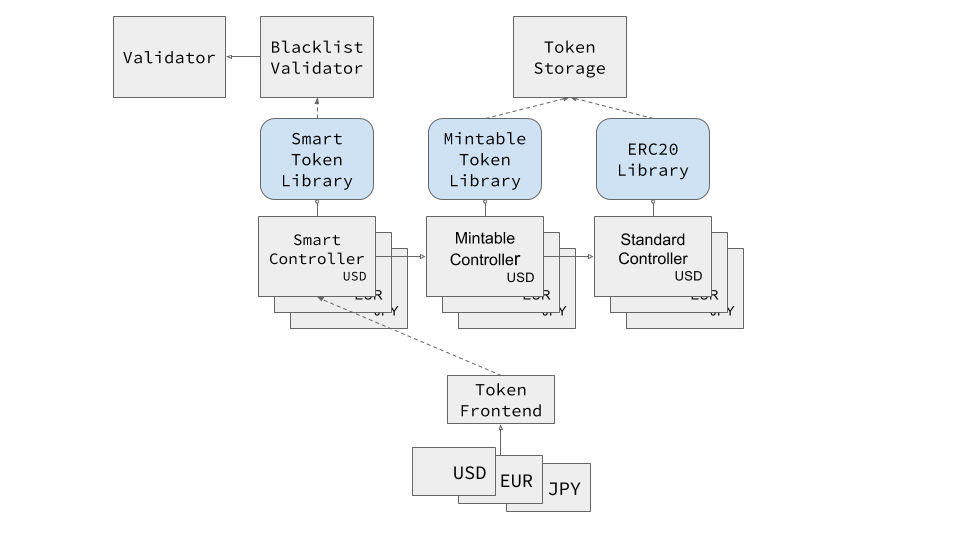

# (Smart) Fiat Tokens

ERC20 is a suggested specification for Ethereum tokens. Once approved as an Ethereum Improvement Proposal (EIP), it will become a part of the standards for the Ethereum platform.

Smart contracts adhering to the specification have a common interface to token-related functionality and events.



*Contracts are represented by grey boxes and libraries by blue boxes with rounded corners*


## Building

1. Clone the repository
	```sh
	$ git clone --recursive https://github.com/monerium/smart-contracts.git
	$ cd smart-contracts
	```

2. Install dependencies

	```sh
	$ yarn install
	```

3. Run truffle

	`$ npx truffle develop`

4. Compile token system

	```sh
	truffle(develop)> compile --all
	```

5. Deploy

	```sh
	truffle(develop)> migrate --reset
	```

6. Run test suite

	```sh
	truffle(develop)> test
	```


## Implementation

The token system is implemented using Solidity, the most widely used high level language targeting the EVM. We build upon community vetted libraries where possible to minimise the risk of bugs.

Additional functionality has been implemented in `MintableTokenLib.sol` and `SmartTokenLib.sol`. This includes minting and burning tokens and defining validators who determine whether token transactions are valid or not.

Functionality which requires authorization is protected by OpenZeppelin's implementation of the Ownable contract. The management of the private key of the owner is very simple at the moment but for v1.0.0 a multi-signature account or a simple DAO will be used.

### Solidity libraries

Libraries in Solidity provide the means to deploy an implementation once as a compiled bytecode but without an execution context (storage). Contracts deployed subsequently can then be statically linked to the library.

Our token system takes advantage of this feature to save gas deploying multiple tokens. It can also be argued that sharing audited libraries between contracts can reduce the risk of bugs &mdash; and worst case ease the replacement of a buggy implementation.

### Token Systems

Our tokens are designed as a token system and implemented using Solidity libraries. A token system is a methodology which aims to separate the token into three modules, providing the means for composable and upgradable tokens.

1. *Frontend*

    This contract implements the token standard and provides a permanent Ethereum address for the token system. All method calls on this contract are forwarded to the controller.

2. *Controller*

    The controller is responsible for the business logic, which is implemented as a library. Our controllers are further separated by the functionality they provide into; standard controller, mintable controller and smart controller.

3. *Storage*

    Permanent token storage for controllers. Should the storage layout change in the future a new token storage with the extra data fields referencing the old token storage.


Using this design we're able to upgrade the business logic &mdash; to fix bugs or add functionality &mdash; while providing a fixed address on the blockchain and permanent access to the token bookkeeping.


## Development

To ease the development, deployment and interaction with the token system we're using truffle.

Truffle's ganache simulates full client behavior and makes developing Ethereum applications much faster while Truffle is a development environment, testing framework and asset pipeline for Ethereum.

Development happens on the master branch and we use [Semantic Versioning](http://semver.org) for our tags. The first pre-release version deployed on a non-testrpc blockchain is v0.7.0.


## Deployment

```sh
# npx truffle migrate [--network <name>]
```

The deployment cycle for beta versions (up to v1.0.0) is as follows. During development the smart contracts are continuously deployed and tested locally on testrpc. A patch version update is deployed on the Monerium testnet, a federated blockchain, run by Monerium. A minor version update is deployed on the Rinkeby testnet.

| Contract            | Rinkeby                                    |
|---------------------| -------------------------------------------|
| ERC20Lib            | 0xf97495963a148a09ff96a4c971bad108a4e23f27 |
| ERC677Lib           | 0xe1d416a18e668a0be12d501391bab7105383b38b |
| EUR                 | 0x7c49d3758987c55d858b7a57a2489693d052b68d |
| Migrations          | 0xf474fd2045f7c41bf97a806837bcc0c97c82e865 |
| MintableTokenLib    | 0x85c80683e06bdc53339383e91b26f40692a911cf |
| SafeMath            | 0xb3dce07230165a13b5b0aeee2ed62834887800c7 |
| SmartController     | 0x785a894ca26220cef6c92ee156426ec5fe2436c6 |
| SmartTokenLib       | 0x31f9ca1f6b43d25b2dc0fea25fc865ef2a7ecebe |
| TokenStorageLib     | 0xb6c1e5e831401b4e4494eeb53122fa4138715daa |
| UIntLib             | 0x5613fd988a46483d8f0dd81145aebc6151f6ff1b |
| USD                 | 0xc2e2547e7848fcb5fd7f98bd3ac9e3bba97b238a |

Current version is v0.8.0.

## Unit tests

The token system ships with JavaScript unit tests.

```sh
# npx truffle test
```


## Code coverage

Code coverage for the token system can be checked with [solidity-coverage](https://github.com/sc-forks/solidity-coverage).

```sh
# npx solidity-coverage
```


## Token interface

```javascript
pragma solidity ^0.4.8;
 
// ----------------------------------------------------------------------------------------------
// Sample fixed supply token contract
// Enjoy. (c) BokkyPooBah 2017. The MIT Licence.
// ----------------------------------------------------------------------------------------------
 
// ERC Token Standard #20 Interface
// https://github.com/ethereum/EIPs/issues/20
contract ERC20Interface {
    // Get the total token supply
    function totalSupply() constant returns (uint256 totalSupply);
 
    // Get the account balance of another account with address _owner
    function balanceOf(address _owner) constant returns (uint256 balance);
 
    // Send _value amount of tokens to address _to
    function transfer(address _to, uint256 _value) returns (bool success);
 
    // Send _value amount of tokens from address _from to address _to
    function transferFrom(address _from, address _to, uint256 _value) returns (bool success);
 
    // Allow _spender to withdraw from your account, multiple times, up to the _value amount.
    // If this function is called again it overwrites the current allowance with _value.
    // this function is required for some DEX functionality
    function approve(address _spender, uint256 _value) returns (bool success);
 
    // Returns the amount which _spender is still allowed to withdraw from _owner
    function allowance(address _owner, address _spender) constant returns (uint256 remaining);
 
    // Triggered when tokens are transferred.
    event Transfer(address indexed _from, address indexed _to, uint256 _value);
 
    // Triggered whenever approve(address _spender, uint256 _value) is called.
    event Approval(address indexed _owner, address indexed _spender, uint256 _value);
}
```


Copyright &copy; 2018, Gísli Kristjánsson for Monerium ehf.
