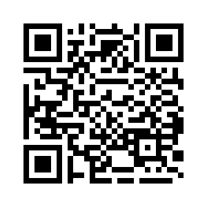
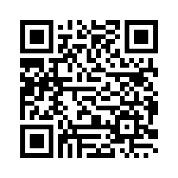
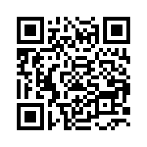
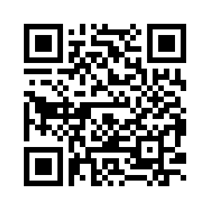
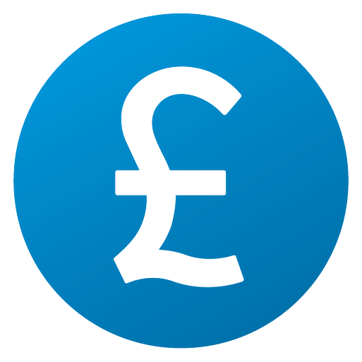
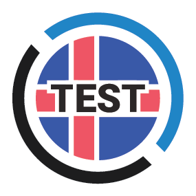
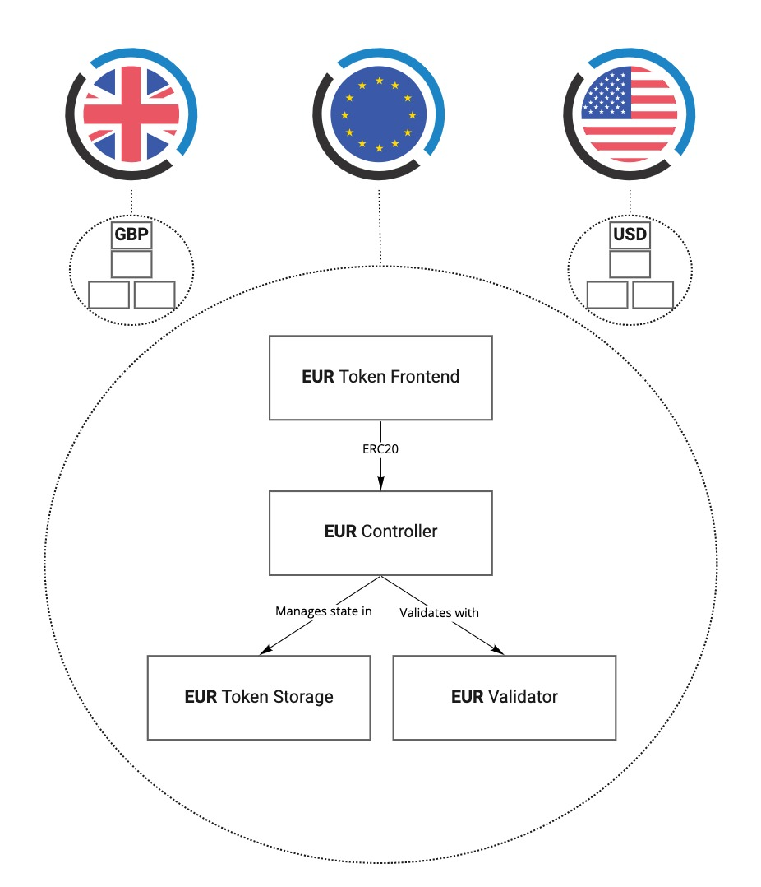
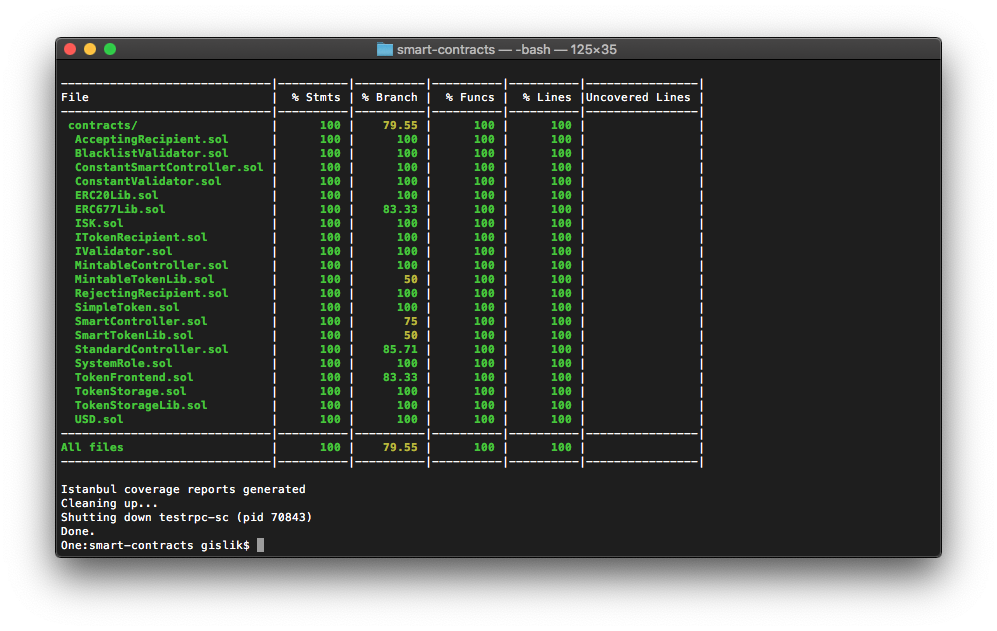

# 


[](https://travis-ci.com/monerium/smart-contracts)

The [Monerium](https://monerium.com) e-money offers programmable fiat money on blockchains, an indispensable building block for the nascent blockchain economy.

Monerium EMI is an Electronic Money Institution, currently the only financial entity licensed to issue e-money on blockchains.
Electronic money (e-money) has been recognized in the European Economic Area (EEA) as a digital alternative to cash since 2000
when the first e-money Directive was introduced. Monerium e-money is 1:1 backed in fully segregated, unencumbered, high-quality
liquid assets and unconditionally redeemable on demand.
Read more about e-money [here](https://monerium.com/monerium/2019/06/28/e-money-the-digital-alternative-to-cash.html).

## Tokens

Monerium e-money tokens [v1.0.3](https://github.com/monerium/smart-contracts/releases/tag/v1.0.3) are live on Ethereum mainnet and are [ERC20](https://eips.ethereum.org/EIPS/eip-20) and [ERC677](https://github.com/ethereum/EIPs/issues/677) compliant.

### Euro / EUR

| Field | Value |
| --- | --- |
| Name | Monerium EUR emoney |
| Contract address  | [0x3231cb76718cdef2155fc47b5286d82e6eda273f](https://etherscan.io/token/0x3231cb76718cdef2155fc47b5286d82e6eda273f)  |
| ENS domain | eur.monerium.eth |
| Symbol | EURe |
| Ticker | EUR |
| Decimals | 18 |
| QR code  |   |
| Logo | <br />[png](assets/tokens/eur/eur.png) / [vector](assets/tokens/eur/eur.svg)  |

### Sterling / GBP

| Field | Value |
| --- | --- |
| Name | Monerium GBP emoney |
| Contract address  | [0x7ba92741bf2a568abc6f1d3413c58c6e0244f8fd](https://etherscan.io/token/0x7ba92741bf2a568abc6f1d3413c58c6e0244f8fd)  |
| ENS domain | gbp.monerium.eth |
| Symbol | GBPe |
| Ticker | GBP |
| Decimals | 18 |
| QR code  |   |
| Logo | <br />[png](assets/tokens/gbp/gbp.png) / [vector](assets/tokens/gbp/gbp.svg)  |

### US Dollar / USD

| Field | Value |
| --- | --- |
| Name | Monerium USD emoney |
| Contract address  | [0xbc5142e0cc5eb16b47c63b0f033d4c2480853a52](https://etherscan.io/token/0xbc5142e0cc5eb16b47c63b0f033d4c2480853a52)  |
| ENS domain | usd.monerium.eth |
| Symbol | USDe |
| Ticker | USD |
| Decimals | 18 |
| QR code  |   |
| Logo | <br />[png](assets/tokens/usd/usd.png) / [vector](assets/tokens/usd/usd.svg)  |

### Icelandic krona / ISK

| Field | Value |
| --- | --- |
| Name | Monerium ISK emoney |
| Contract address  | [0xc642549743a93674cf38d6431f75d6443f88e3e2](https://etherscan.io/token/0xc642549743a93674cf38d6431f75d6443f88e3e2)  |
| ENS domain | isk.monerium.eth |
| Symbol | ISKe |
| Ticker | ISK |
| Decimals | 18 |
| QR code  |   |
| Logo | <br />[png](assets/tokens/isk/isk.png) / [vector](assets/tokens/isk/isk.svg)  |

## Test tokens

For the innovators, product builders, and other curious minds we've opened up a sandboxed version of our system that is
connected to the Rinkeby test network. Play around with our money in a safe environment to understand how this fits into
your platform. [Go to sandbox](https://sandbox.monerium.dev/).

Please fill out the "Partner with Monerium" form on [monerium.com](https://monerium.com/#partners) to get test money for the Ropsten or Kovan test networks.

**Contract addresses for the test networks:**

| Token    | Logo | Rinkeby ([v1.0.3](https://github.com/monerium/smart-contracts/releases/tag/v1.0.3)) | Ropsten ([v1.0.3](https://github.com/monerium/smart-contracts/releases/tag/v1.0.3)) | Kovan ([v1.0.3](https://github.com/monerium/smart-contracts/releases/tag/v1.0.3))   |
| -------- | --- | ----------------------------------------------------------------------------------- | ----------------------------------------------------------------------------------- | ----------------------------------------------------------------------------------- |
| EUR | <div><br /><small>[png](assets/tokens/eur/eur.test.png) / [vector](assets/tokens/eur/eur.test.svg)</small></div> | 0x25c13fc529dc4afe4d488bd1f2ee5e1ec4918e0b | 0x0ae91c2b9e31e92871129117d908b0963c054048 | 0x9b8fd8fcfaa2438d11e7ed77d5afb6c2e1044b37 |
| GBP | <div><br /><small>[png](assets/tokens/gbp/gbp.test.png) / [vector](assets/tokens/gbp/gbp.test.svg)</small></div> | 0x01df10e345d0364d3a5b8422a66af6305803bd1e | 0xd9979346224e7b147caddf399b56357e20d3e67c | 0xe28884ed5bd43e3f9f1dd733d254c9f5c6f983d2 |
| ISK | <div><br /><small>[png](assets/tokens/isk/isk.test.png) / [vector](assets/tokens/isk/isk.test.svg)</small></div> | 0x0c9d7a0d8bf4bc9d15f577bbf650ebc8044a71db | 0x80b02ef56cbbc542f0ce89ad1d2a680244da9a63 | 0x39ad1ad871787ba4b3df5b8ac3d81b2c9b7c6290 |
| USD | <div><br /><small>[png](assets/tokens/usd/usd.test.png) / [vector](assets/tokens/usd/usd.test.svg)</small></div> | 0x09c0a236e1227500f495cb0731c4af69b49639a5 | 0x3781dcdd60e006e33b664dce0d6be934f0a139c8 | 0x57724f65b3f914de7820c6f76b2099fa3a90f509 |

## Using Monerium money / Token integration

We at [Monerium](https://monerium.com) are really excited to talk to all developers and builders that want to use money in their applications.
Go to [monerium.com](https://monerium.com/#partners) and fill out the "Partner with Monerium" form and our expert staff
will be available to help you every step of the way, from implementation to ongoing operations.
 
Each token has the following [ERC20](https://eips.ethereum.org/EIPS/eip-20) and [ERC677](https://github.com/ethereum/EIPs/issues/677) methods available to integrate with your application.

```js
contract Euro {

  // Transfers tokens [ERC20].
  transfer(to, amount)

  // Transfers tokens from a specific address [ERC20].
  transferFrom(from, to, amount)

  // Approves a spender [ERC20].
  approve(spender, amount)

  // Transfers tokens and subsequently calls a method
  // on the recipient [ERC677].
  transferAndCall(to, amount, data)

  // Returns the total supply.
  totalSupply()

  // Returns the number tokens associated with an address.
  balanceOf(who)

  // Returns the allowance for a spender.
  allowance(owner, spender)
}

```

### [ERC20](https://eips.ethereum.org/EIPS/eip-20) / Approve and transfer from

The user gives your smart contract the right to take the money by itself from their address using the `approve` method.
Once approved, your contract can call the `transferFrom` method in the Monerium contract and transfer money from the address.

### [ERC677](https://github.com/ethereum/EIPs/issues/677) / Transfer and call

`transferAndCall` transfers money and calls the receiving contract's `onTokenTransfer` method with additional data and triggers an event Transfer.

## Token Design

Four cooperating Ethereum smart-contracts are deployed for each e-money currency token that is [ERC20](https://eips.ethereum.org/EIPS/eip-20) compliant.

* **Token Frontend**: This contract implements the [ERC20](https://eips.ethereum.org/EIPS/eip-20) token standard and provides a permanent Ethereum address for the token system. The contract only exposes the required ERC20 functionality to the user and delegates all of the execution to the controller.
* **Controller**: The controller is responsible for the business logic. The controllers are further separated by the functionality they provide into; StandardController, MintableController and SmartController.
* **Token Storage**: Storage of e-money token ledger.
* **Validator**: The validator can be used by the controllers to approve and validate transactions before they are made.



Using this design we're able to upgrade the business logic, to fix bugs or add functionality, while providing a fixed address on the blockchain and permanent access to the token bookkeeping.

### Implementation

The token system is implemented using Solidity, the most widely used high level language targeting the EVM. We build upon community vetted libraries where possible to minimize the risk of bugs.

Additional functionality has been implemented in `MintableTokenLib.sol` and `SmartTokenLib.sol`. This includes minting and burning tokens and defining validators who determine whether token transactions are valid or not.

Functionality which requires authorization is protected by OpenZeppelin's implementation of the Ownable contract. The management of the private key of the owner is very simple at the moment but for v1.0.0 a multi-signature account or a simple DAO will be used.

### Solidity libraries

Libraries in Solidity provide the means to deploy an implementation once as a compiled byte code but without an execution context (storage). Contracts deployed subsequently can then be statically linked to the library.

Our token system takes advantage of this feature to save gas deploying multiple tokens. It can also be argued that sharing audited libraries between contracts can reduce the risk of bugs and worst case ease the replacement of a buggy implementation.

## Building

1. Clone the repository

    ```sh
    git clone --recursive https://github.com/monerium/smart-contracts.git
    cd smart-contracts
    ```

2. Install dependencies

    ```sh
    yarn install
    ```

3. Run truffle

    ```sh
    npx truffle develop
    ```

4. Compile token system

    ```sh
    truffle(develop)> compile --all
    ```

5. Deploy

    ```sh
    truffle(develop)> migrate --reset
    ```

6. Run test suite

    ```sh
    truffle(develop)> test
    ```

## Development

To ease the development, deployment and interaction with the token system we're using truffle.

Truffle's ganache simulates full client behavior and makes developing Ethereum applications much faster while Truffle is a development environment, testing framework and asset pipeline for Ethereum.

Development happens on the master branch and we use [Semantic Versioning](http://semver.org) for our tags. The first pre-release version deployed on a non-testrpc blockchain is v0.7.0.

## Deployment

```sh
# npx truffle migrate [--network <name>]
```

## Unit tests

The token system ships with JavaScript unit tests.

```sh
# make test
```

## Code coverage

Code coverage for the token system can be checked with [solidity-coverage](https://github.com/sc-forks/solidity-coverage).

```sh
# make coverage
```



## License

```text
Copyright 2019 Monerium ehf.

Licensed under the Apache License, Version 2.0 (the "License");
you may not use this file except in compliance with the License.
You may obtain a copy of the License at

    http://www.apache.org/licenses/LICENSE-2.0

Unless required by applicable law or agreed to in writing, software
distributed under the License is distributed on an "AS IS" BASIS,
WITHOUT WARRANTIES OR CONDITIONS OF ANY KIND, either express or implied.
See the License for the specific language governing permissions and
limitations under the License.
```
