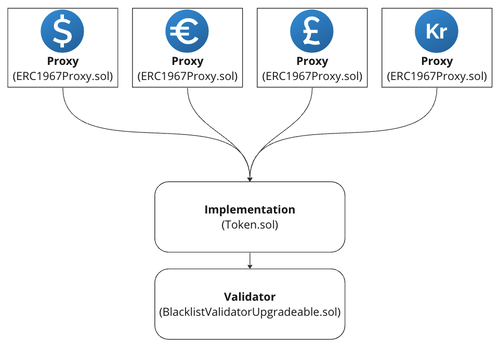

# Introducing Monerium's v2 Token Contract: What You Need to Know

## What is happening

Monerium is upgrading the token smart contracts (EURe, USDe, GBPe, and ISKe) from version 1 (V1) to version 2 (V2). [Ackee Blockchain Security](https://ackeeblockchain.com/), an industry leader trusted by top-tier organizations in web3 like Safe and 1inch, audited the new smart contracts. [The report is available here](../audits/v2.0.0-ackee-blockchain-monerium-smart-contracts-report-1.1.pdf).

Monerium's upgrade to the v2 token contract is a significant step towards adopting the most advanced and widely accepted ERC standards. By leveraging OpenZeppelin's community-vetted libraries, Monerium ensures its tokens align with industry best practices and benefit from enhanced security and functionality. OpenZeppelin provides a robust framework that simplifies the integration of complex features, such as Permit (ERC2612), facilitates a smoother upgrade process, and guarantees that Monerium's tokens remain compliant with evolving ERC standards.

## Why the upgrade matters to you

Monerium's upgrade to v2 of the token contract significantly benefits our users. This update delivers tangible benefits such as cost savings and enhanced features.

### 1. Gas Cost Efficiency

The new contract includes optimized functions that significantly reducing gas consumption, making onchain transactions much cheaper for users.
<table>
    <thead>
        <tr>
            <th>
                Function 
                <small style="white-space: nowrap;">ERC20 function</small>
            </th>
            <th>
                V1 
                <small style="white-space: nowrap;">gas used</small>
            </th>
            <th>
                V2 
                <small style="white-space: nowrap;">gas used</small>
            </th>
            <th>
            Difference 
                <small style="white-space: nowrap;">How much gas you save</small>
            </th>
        </tr>
    </thead>
    <tbody>
        <tr>
            <td>
                <b>Transfer</b> 
                <small>Sends tokens to another address.</small>
            </td>
            <td>91908</td>
            <td>26245</td>
            <td style="color:#6fbf7e">71%</td>
        </tr>
        <tr>
            <td>
                <b>Approve</b> 
                <small>Allows someone to spend tokens from your account.</small>
            </td>
            <td>68586</td>
            <td>24858</td>
            <td style="color:#6fbf7e">64%</td>
        </tr> 
    </tbody>
</table>

### 2. New Features - Permit (ERC2612)

The V2 contracts now support the [ERC-2612 Permit](https://eips.ethereum.org/EIPS/eip-2612) functionality. Developers should use ERC-2612 Permit instead of [ERC-20 Approve](https://eips.ethereum.org/EIPS/eip-20) because it allows for gasless token approvals through off-chain signatures, eliminating the need for a separate on-chain approval transaction. Using Permit, developers can create more efficient and user-friendly applications, enhancing security and flexibility within the Ethereum ecosystem.

For more information, [read our tutorial](./docs/permit.md).

## Continued Support for v1 Tokens

We understand that transitioning can take time, and users may have various needs and preferences. Therefore, it's important to note that v1 tokens will continue to be supported. You can still use your v1 tokens as usual without any immediate need to upgrade. 

In V1,  four Ethereum smart contracts were deployed to work together for each token.

* **Frontend**: This contract provides the permanent Ethereum address for the token you add to your wallet. The contract only exposes the required functionality to the user and delegates all of the execution to the controller.
* **Controller**: The controller is responsible for the business logic and is upgradable.
* **Storage**: Storage of the token ledger, i.e., keeps track of all balances.
* **Validator**: Used by the controllers to validate transactions.

     
    <em>Figure: V1 Token design</em>

The V2 token architecture uses OpenZeppelin's [UUPS Proxy Pattern](https://docs.openzeppelin.com/contracts/4.x/api/proxy#UUPSUpgradeable) for Upgradability. 

* **Proxy (ERC1967Proxy.sol)**:  Similar to the front end and storage in V1, the proxy contract provides the permanent Ethereum address for the token and delegates the function calls to the implementation contract. In addition it keeps track of all of the balances, like the storage in V1. The four proxy contracts corresponding to each token (EURe, GBPe, USDe, and ISKe) share the same implementation contract.
* **Implementation (Token.sol)**: Similar to the controller in V1,the Implementation contract is responsible for the business logic.
* **Validator**: Used by the Implementation contract to approve and validate transactions before they are made. 

     
    <em>Figure: V2 Token design</em>

The V1 front end will now utilize the V2 Proxy as its controller. Whether you use the V1 front end or V2 Proxy when importing the token to your wallet, you will experience reduced gas costs and see the same balance.

     
    <em>Figure: V1 Frontend using V2 Proxy as controller</em>

## How to use the V2 tokens

All information about token addresses, supported chains, etc., can be found at [https://monerium.dev/docs/tokens](https://monerium.dev/docs/tokens).